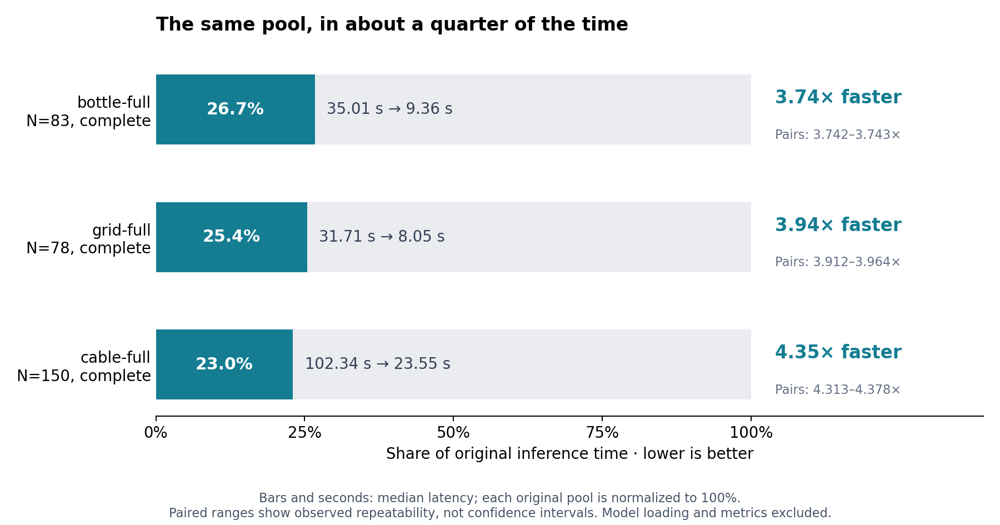
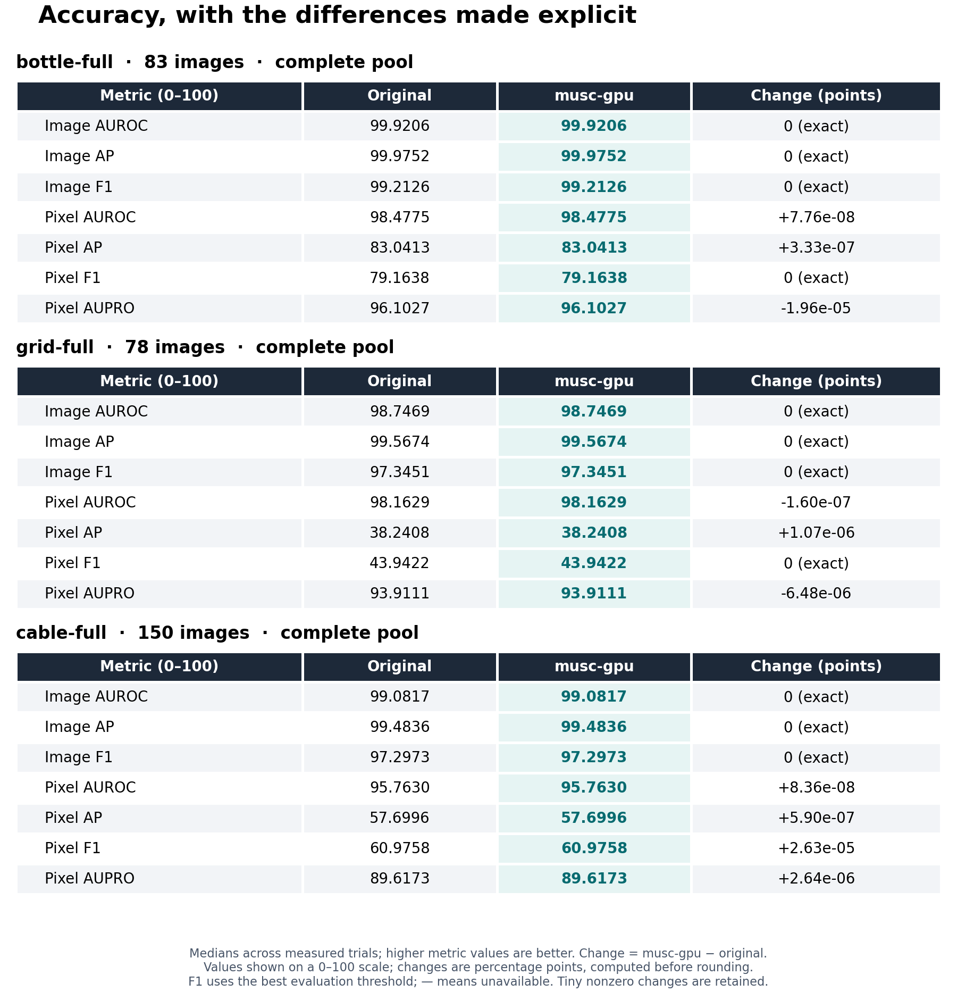
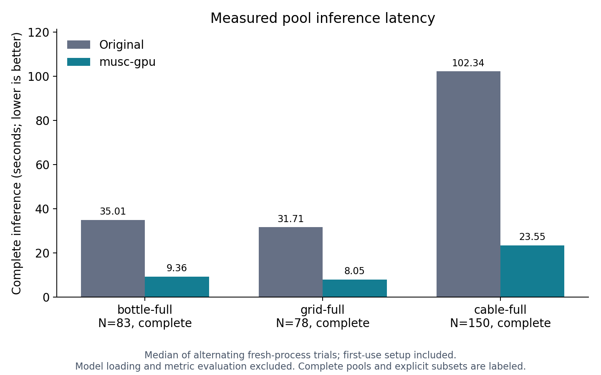
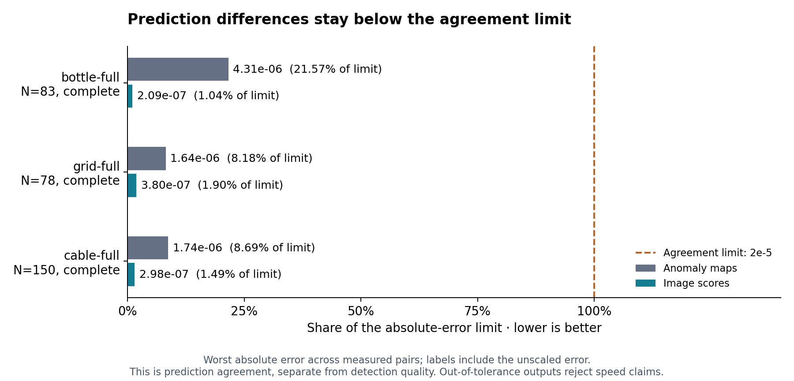
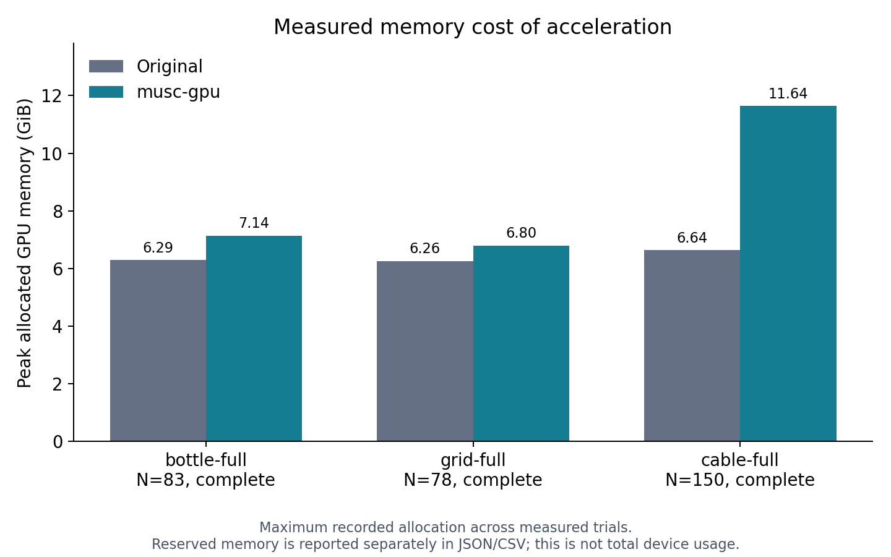

# musc-gpu

**GPU-accelerated MuSc for zero-shot industrial anomaly detection and segmentation.**

Score a pool of unlabeled images and locate anomalies without task-specific
training. This independently maintained implementation measures **3.74–4.35×
faster complete-pool inference** than original MuSc on bottle, grid and cable
from MVTec AD, using an NVIDIA RTX 3090. The original backend remains selectable.

[Quick start](#quick-start) · [Benchmarks](#measured-performance) ·
[Implementation](docs/IMPLEMENTATION.md) · [Reproduce results](docs/BENCHMARK.md) ·
[Releases](https://github.com/DylanMartinLSC/musc-gpu/releases)

> **Accelerated platform: native Windows + NVIDIA CUDA.** Published results use
> CLIP ViT-L-14-336/OpenAI at 518px. Linux, WSL and CPU select the original
> backend; accelerated kernels are not implemented for those platforms.

Based on **MuSc (ICLR 2024)** by Xurui Li, Ziming Huang, Feng Xue and Yu Zhou.
See the [original repository](https://github.com/xrli-U/MuSc),
[paper](https://arxiv.org/abs/2401.16753) and
[attribution notices](THIRD_PARTY_NOTICES.md). This is an unofficial project.

## Quick start

Use PowerShell on native Windows with an NVIDIA GPU and a CUDA-compatible driver.
The measured package pair is **PyTorch 2.7.1 / torchvision 0.22.1, CUDA 11.8**.
Python 3.10 is a conservative setup choice, not a tested compatibility matrix.
See the [recorded package versions](benchmarks/representative/environment_packages.json).

```powershell
git clone https://github.com/DylanMartinLSC/musc-gpu.git
cd musc-gpu
python -m venv .venv
.venv/Scripts/python.exe -m pip install torch==2.7.1 torchvision==0.22.1 --index-url https://download.pytorch.org/whl/cu118
.venv/Scripts/python.exe -m pip install -r requirements.txt
```

Obtain MVTec AD separately and point `--data_path` at the directory containing
its category folders. Preserve the dataset layout, for example:

```text
mvtec_anomaly_detection/
└── bottle/
    ├── test/
    │   ├── good/
    │   └── broken_large/
    └── ground_truth/
        └── broken_large/
```

The tree shows only a few folders; keep the complete category test pool and
its ground-truth masks. The example evaluates that pool together: MuSc uses
other images as references, so changing the pool changes the task.

```powershell
.venv/Scripts/python.exe examples/musc_main.py --data_path C:/path/to/mvtec_anomaly_detection --class_name bottle --inference_backend gpu
```

The first model load downloads OpenAI weights if absent. The command prints
image-level and pixel-level evaluation metrics. Add `--vis true --save_excel true`
to save heatmaps and `results.xlsx` under `output/` (organized by dataset,
model and image size). Metrics and visualization run after inference; they
can add substantial time beyond the inference timings below.

Defaults are in [configs/musc.yaml](configs/musc.yaml). The published comparison
uses batch size 4, one complete reference pool, feature indices 5/11/17/23 and
radii 1/3/5. No labels or masks enter anomaly scoring; evaluation uses them.

### Original backend and troubleshooting

To run the numerical reference implementation:

```powershell
.venv/Scripts/python.exe examples/musc_main.py --data_path C:/path/to/mvtec_anomaly_detection --class_name bottle --inference_backend original
```

| Situation | What to do |
|---|---|
| Linux, WSL or CUDA unavailable | The GPU request selects the original backend and prints a reason. These paths are not performance-qualified here. |
| Missing NVRTC DLL or a Windows CUDA runtime error | Check the PyTorch/CUDA installation above, or explicitly use `--inference_backend original`. Runtime errors do not silently fall back. |
| Insufficient GPU memory | Check the measured peaks below and leave room for reserved memory and other processes. Larger pools need a separate capacity assessment. |
| Different backbone, weights or resolution | Use the original backend for unvalidated configurations; published speedups apply only to the stated configuration. |

The custom runtime loads NVRTC DLLs supplied with Windows PyTorch and uses the
caller's CUDA stream. The attention wrapper uses native PyTorch outside its
supported dispatch. See [implementation details](docs/IMPLEMENTATION.md).

## Measured performance

**Complete category pools, RTX 3090, two alternating original/GPU pairs.** Each
pass starts in a fresh process and includes first-use compilation, decoding,
preprocessing, transfers, encoding, aggregation, scoring, interpolation and
RsCIN. Model loading and metrics are measured separately. There is no discarded
image warmup; OS filesystem caches are not flushed.

| Category | Images | Original median | musc-gpu median | Speedup | GPU peak allocated |
|---|---:|---:|---:|---:|---:|
| bottle | 83 | 35.01 s | 9.36 s | **3.74×** | 7.14 GiB |
| grid | 78 | 31.71 s | 8.05 s | **3.94×** | 6.80 GiB |
| cable | 150 | 102.34 s | 23.55 s | **4.35×** | 11.64 GiB |



The ratio of summed category medians is **4.13×**. This covers these three
categories, not all of MVTec AD or other GPUs/backbones. Pool throughput is
not independent single-image latency. No verified 10× result exists.

**Numerical agreement:** every full-resolution map and image score passes the
**2e-5 absolute tolerance**. Maximum map errors are 4.315e-6 (bottle), 1.636e-6
(grid) and 1.738e-6 (cable). Image AUROC/AP/F1 agree in these runs; pixel
AUROC/AP/F1/AUPRO remain close, with exact deltas in the raw JSON. Agreement
within tolerance does not imply bitwise identity or accuracy guarantees elsewhere.

The scorecards show both backends on a 0–100 scale and the signed change in
percentage points, including differences too small to see on a conventional plot.



**Memory tradeoff:** original peak allocations are 6.29, 6.26 and 6.64 GiB,
respectively. The accelerated peaks above are tensor allocations, not total
device usage or minimum VRAM requirements. Reserved memory is recorded separately.

[Full report](benchmarks/representative/REPORT.md) ·
[Raw JSON](benchmarks/representative/results.json) ·
[CSV](benchmarks/representative/summary.csv)

<details>
<summary>More charts: absolute latency, numerical agreement and memory</summary>





</details>

## Reproduce and verify

Run the complete comparison from the repository root. Use a **new output
directory** for each run and an exclusive GPU slot. Allow several GiB of disk
space for prediction arrays. The benchmark has a fixed backbone/configuration;
editing `configs/musc.yaml` does not change it.

```powershell
.venv/Scripts/python.exe tools/benchmark.py --data-path C:/path/to/mvtec_anomaly_detection --plan-only
.venv/Scripts/python.exe tools/benchmark.py --data-path C:/path/to/mvtec_anomaly_detection --categories bottle grid cable --pairs 2 --include-pro --output benchmarks/runs/representative
```

See the [benchmark guide](docs/BENCHMARK.md) for timing boundaries, report
commands, smaller-pool tests, capacity checks and failure handling.
`--categories all` requests all 15 categories; only successful complete-pool
runs support category-level claims.

Check release integrity without weights, torch imports or CUDA trials:

```powershell
.venv/Scripts/python.exe tools/verify_release.py
.venv/Scripts/python.exe tools/test_benchmark.py
```

## Project guide

| Resource | Contents |
|---|---|
| [Implementation and verification](docs/IMPLEMENTATION.md) | GPU scoring, pooling, loading, normalization reuse, attention and historical qualification |
| [Benchmark protocol](docs/BENCHMARK.md) | Reproducible comparisons, timing scope and numerical gates |
| [Representative results](benchmarks/representative/REPORT.md) | Measured speed, quality and memory for three complete pools |
| [Source manifest](SOURCE_MANIFEST.json) | Packaged source and evidence hashes |
| [Issue tracker](https://github.com/DylanMartinLSC/musc-gpu/issues) | Bug reports and feature requests |

For a useful bug report, include the command, OS, GPU/VRAM, Python and
PyTorch/CUDA versions, backend, category/pool size and full error message.
For benchmark discrepancies, include the result JSON and timing scope.

## Citation and license

Please cite the original MuSc paper when using its method:

```bibtex
@inproceedings{li2024musc,
  title={MuSc: Zero-Shot Industrial Anomaly Classification and Segmentation with Mutual Scoring of the Unlabeled Images},
  author={Li, Xurui and Huang, Ziming and Xue, Feng and Zhou, Yu},
  booktitle={International Conference on Learning Representations},
  year={2024}
}
```

Preserved MuSc [MIT license](LICENSE). Bundled third-party sources retain their
applicable licenses; see [THIRD_PARTY_NOTICES.md](THIRD_PARTY_NOTICES.md).
